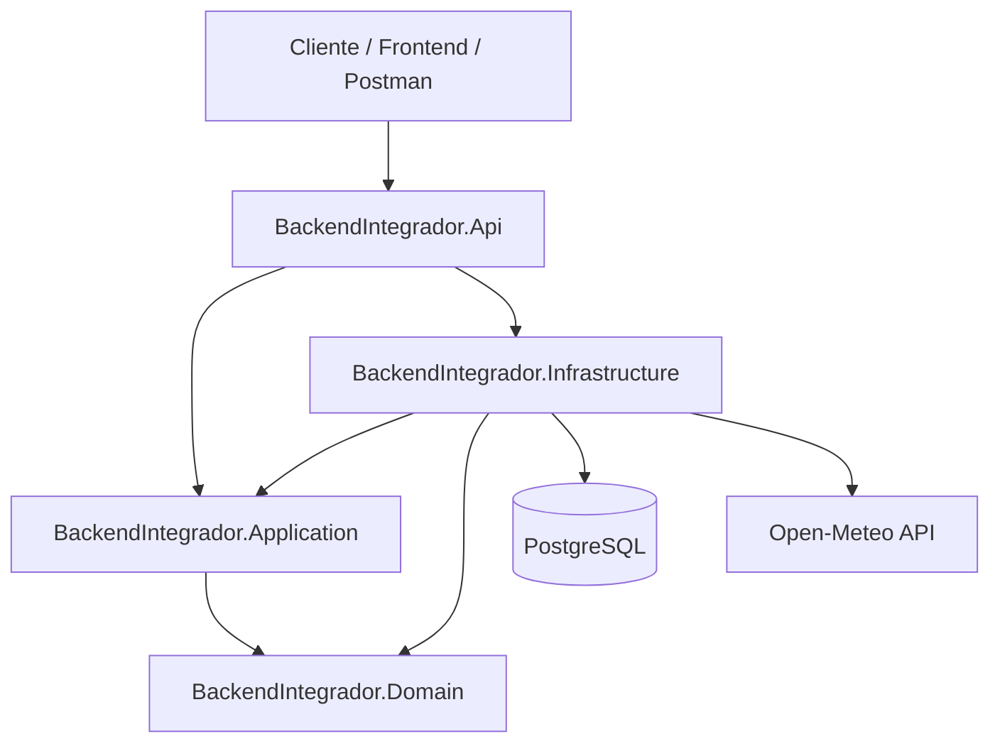
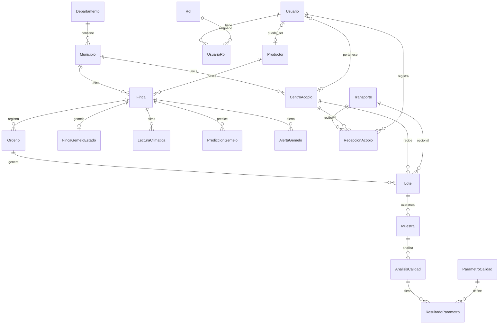
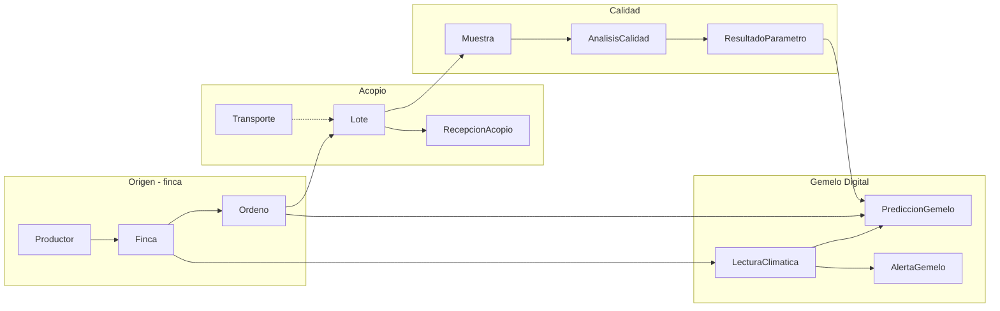

# BackendIntegrador — Control Lácteo

API REST en **.NET 8** para el portal **Control Lácteo**: trazabilidad del proceso lechero (desde la finca hasta el análisis de calidad), gestión de usuarios con roles excluyentes, y **Gemelo Digital** predictivo por finca (clima → producción → calidad).

---

## Tabla de contenidos

1. [Visión general](#visión-general)
2. [Dominio de negocio](#dominio-de-negocio)
3. [Arquitectura](#arquitectura)
4. [Reglas de negocio](#reglas-de-negocio)
5. [Modelo de datos](#modelo-de-datos)
6. [Flujo de trazabilidad láctea](#flujo-de-trazabilidad-láctea)
7. [Módulos del sistema](#módulos-del-sistema)
8. [Referencia de API](#referencia-de-api)
9. [Autenticación y seguridad](#autenticación-y-seguridad)
10. [Configuración](#configuración)
11. [Estructura del repositorio](#estructura-del-repositorio)
12. [Persistencia y migraciones](#persistencia-y-migraciones)
13. [Pruebas](#pruebas)
14. [Ejecución local](#ejecución-local)
15. [Despliegue en Render](#despliegue-en-render)
16. [Stack tecnológico](#stack-tecnológico)

---

## Visión general

BackendIntegrador es el backend del integrador universitario **Control Lácteo**. Centraliza:

| Área | Qué resuelve |
|------|----------------|
| **Identidad y acceso** | Usuarios, JWT, cuatro roles mutuamente excluyentes |
| **Catálogos geográficos** | Departamentos, municipios, centros de acopio |
| **Cadena productiva** | Productores, fincas, ordeños, lotes |
| **Logística básica** | Transportes y recepciones en acopio |
| **Calidad láctea** | Muestras, análisis y resultados por parámetro |
| **Gemelo Digital** | Predicciones y alertas climáticas por finca (sin enfoque logístico) |

Principios de diseño:

- **Clean Architecture** con dependencias hacia el dominio.
- **API orientada al frontend** en usuarios (patrón Facade, DTOs polimórficos).
- **CRUD genérico** para entidades transaccionales con llave entera.
- **PostgreSQL + EF Core** para persistencia relacional en entorno académico y despliegue con Docker.
- **Cobertura de pruebas** con xUnit, Moq y tests de integración HTTP.

---

## Dominio de negocio

### Actores

| Actor | Descripción |
|-------|-------------|
| **Administrador** | Gestión global del sistema |
| **Centro de Acopio** | Responsable operativo de un centro de recepción |
| **Trabajador Centro de acopio** | Personal operativo del centro |
| **Productor** | Productor lácteo con una o más fincas |

### Proceso lechero modelado

```
Productor → Finca → Ordeño → Lote → [Transporte] → Recepción en acopio
                              ↓
                           Muestra → Análisis de calidad → Resultados por parámetro
```

El **Gemelo Digital** usa la rama **Finca → Ordeño → … → ResultadoParametro** junto con datos climáticos externos para alertas preventivas. No optimiza rutas ni transporte.

---

## Arquitectura

### Capas

| Capa | Proyecto | Responsabilidad |
|------|----------|-----------------|
| **Dominio** | `BackendIntegrador.Domain` | Entidades POCO, sin dependencias externas |
| **Aplicación** | `BackendIntegrador.Application` | Contratos (`I*Service`), DTOs, validadores, settings |
| **Infraestructura** | `BackendIntegrador.Infrastructure` | EF Core, repositorio genérico, servicios concretos |
| **API** | `BackendIntegrador.Api` | Controladores HTTP, JWT, Swagger, middleware |



### Patrones aplicados

| Patrón | Dónde | Propósito |
|--------|-------|-----------|
| **Facade** | `UsuarioFacadeService` | Un endpoint devuelve perfil completo según rol; evita *Chatty API* |
| **Repository genérico** | `IRepository<T>` + `EfRepository<T>` | CRUD de entidades sin repetir código |
| **CRUD service base** | `IntKeyCrudServiceBase` | Servicios por entidad con llave `int` |
| **DTO polimórfico** | `UsuarioPerfilBaseDto` + `[JsonPolymorphic]` | Respuestas JSON específicas por rol |
| **Strategy / Provider** | `IClimateDataProvider` | Integración climática intercambiable |
| **Middleware global** | `ExceptionHandlingMiddleware` | Errores JSON uniformes |

### Pipeline HTTP

```
Request → ExceptionHandlingMiddleware → Authentication → Authorization → Controller → Service → DbContext
```

- Respuestas de éxito en controladores CRUD/Facade: envoltorio `{ message, data, status }` vía `ApiResponseFilter` (donde aplica).
- Errores no controlados: `{ success: false, status, method, errors, response: null }`.

---

## Reglas de negocio

### Usuarios y roles

1. **Un usuario = un rol.** Se asigna exactamente un `RolId` en alta y actualización.
2. **Cuatro roles canónicos** (nombre exacto en BD):

| `tipoUsuario` (JSON) | Nombre en BD |
|----------------------|--------------|
| `administrador` | `Administrador` |
| `centro_acopio` | `Centro de Acopio` |
| `productor` | `Productor` |
| `trabajador_centro_acopio` | `Trabajador Centro de acopio` |

3. **Restricciones estructurales** (`UsuarioRoleValidator`):

| Rol | `centroAcopioId` | `productor` / fincas |
|-----|------------------|----------------------|
| Administrador | Debe ser `null` | Prohibido |
| Centro de Acopio | **Requerido** | Prohibido |
| Trabajador Centro de acopio | **Requerido** | Prohibido |
| Productor | Debe ser `null` | **Requerido** (datos de productor) |

4. **Centro de Acopio y Trabajador** nunca tienen fincas asociadas.
5. **Productor** nunca está vinculado a un centro de acopio como lugar de trabajo.
6. **Cambio de rol** de un usuario que ya tiene registro `Productor` → **bloqueado**; se debe desactivar y crear uno nuevo.
7. **Desactivación** de usuario: `DELETE /api/usuarios/{id}` pone `estado = inactivo` (no borrado físico).
8. **Registro público:** `POST /api/usuarios` es anónimo (`AllowAnonymous`); el resto de operaciones de usuarios requiere JWT.

### Autenticación

- Contraseñas hasheadas con **BCrypt**.
- Login rechaza usuarios con `estado != activo`.
- JWT incluye claims: `NameIdentifier` (usuarioId), `Email`, `Role` (nombre del rol).
- Cambio de contraseña: usuario autenticado verifica contraseña actual.
- Reset de contraseña: `POST /api/usuarios/{id}/reset-password` (admin u operador autorizado).

### Trazabilidad y calidad

- Un **Lote** vincula un **Ordeño** (origen en finca) con un **CentroAcopio** y opcionalmente un **Transporte**.
- **Muestra** se toma sobre un lote; **AnálisisCalidad** sobre una muestra.
- **ResultadoParametro** usa llave compuesta `(AnalisisId, ParametroId)`.
- **ParametroCalidad** define rangos (`ValorMinimo`, `ValorMaximo`) — catálogo extensible (Acidez, Grasa, Proteína, CCS, etc.).

### Gemelo Digital

- **Un gemelo por finca** (`FincaId`).
- Sincronización requiere **`Latitud` y `Longitud`** en la finca.
- Fuentes climáticas: **Open-Meteo** (histórico 90 días + pronóstico 7 días por defecto).
- Índice **THI** (estrés térmico) calculado a partir de temperatura y humedad.
- Alertas no se duplican del mismo tipo en ventana de 24 h.
- **Sin alcance logístico:** no modela rutas, flotas ni cadena de frío de transporte.

### Integridad referencial

- Todas las FK usan `DeleteBehavior.Restrict` — no hay borrado en cascada.
- Índices únicos relevantes: `Usuario.Email`, `Rol.Nombre`, `Productor.Documento`, `Productor.UsuarioId`, `(FincaId, Fecha)` en lecturas climáticas.

---

## Modelo de datos

### Diagrama general



### Entidades por grupo

#### Identidad
| Entidad | Campos clave |
|---------|--------------|
| `Usuario` | Email (único), PasswordHash, Estado, FechaCreacion, CentroAcopioId? |
| `Rol` | Nombre (único), Descripcion |
| `UsuarioRol` | PK compuesta (UsuarioId, RolId) |

#### Geografía y acopio
| Entidad | Campos clave |
|---------|--------------|
| `Departamento` | Nombre (único) |
| `Municipio` | Nombre, DepartamentoId |
| `CentroAcopio` | Nombre, Direccion, Latitud, Longitud, MunicipioId |
| `TipoDocumento` | Nombre (único), Descripcion |

#### Producción
| Entidad | Campos clave |
|---------|--------------|
| `Productor` | Nombre, Documento (único), Telefono, UsuarioId (único), TipoDocumentoId |
| `Finca` | Nombre, Direccion, Latitud, Longitud, ProductorId, MunicipioId |
| `Ordeno` | FechaHoraInicio, FechaHoraFin?, VolumenLitros, FincaId |

#### Logística y recepción
| Entidad | Campos clave |
|---------|--------------|
| `Transporte` | PlacaVehiculo, FechaHoraSalida, FechaHoraEntrada?, TemperaturaInicio? |
| `Lote` | OrdenoId, CentroAcopioId, VolumenCapturadoLitros, TransporteId? |
| `RecepcionAcopio` | TransporteId, CentroAcopioId, FechaHoraEntrada, UsuarioId, TemperaturaRecepcion?, VolumenLitrosRecibidos |

#### Calidad
| Entidad | Campos clave |
|---------|--------------|
| `Muestra` | LoteId, TecnicoPorUsuarioId, FechaHoraToma |
| `AnalisisCalidad` | MuestraId, FechaHoraAnalisis, Observaciones |
| `ParametroCalidad` | Nombre (único), Unidad, ValorMinimo?, ValorMaximo? |
| `ResultadoParametro` | PK (AnalisisId, ParametroId), ValorResultado, Observacion |

#### Gemelo Digital
| Entidad | Campos clave |
|---------|--------------|
| `FincaGemeloEstado` | PK = FincaId; UltimaSyncUtc, VersionMotor, ScoreRiesgoGlobal, EstadoSync |
| `LecturaClimatica` | FincaId + Fecha (único); temps, humedad, THI, DiasConsecutivosCalor |
| `PrediccionGemelo` | TipoPrediccion, HorizonteDias, Valor, Confianza |
| `AlertaGemelo` | TipoAlerta, Severidad, Titulo, Mensaje, Recomendacion, Leida |

---

## Flujo de trazabilidad láctea



**Orden sugerido de carga de datos (Postman / seed):**

1. Departamento → Municipio → Centro de Acopio → Tipo de Documento  
2. Roles (4 nombres canónicos)  
3. Usuario por rol (o registro anónimo)  
4. Finca con coordenadas GPS  
5. Ordeño → Transporte → Lote → Recepción  
6. Parámetros de calidad → Muestra → Análisis → Resultados  
7. Gemelo: `POST .../gemelo/sincronizar`

---

## Módulos del sistema

### 1. Autenticación (`AuthController`)

Login JWT, cambio de contraseña del usuario autenticado. Ver [Autenticación y seguridad](#autenticación-y-seguridad).

### 2. Usuarios — Facade (`UsuariosController` + `UsuarioFacadeService`)

Consolida alta transaccional de usuario + rol + productor + finca inicial en una sola petición.

**Lecturas condicionales por rol:** EF carga solo las relaciones pertinentes (productor/fincas solo para rol Productor; centro de acopio solo para roles de centro).

**Respuestas polimórficas** con discriminador JSON `tipoUsuario`:

```json
{
  "tipoUsuario": "productor",
  "usuarioId": 1,
  "email": "productor@finca.com",
  "estado": "activo",
  "fechaCreacion": "2026-04-29T00:00:00Z",
  "rol": { "rolId": 3, "nombre": "Productor", "descripcion": "Productor lacteo" },
  "productor": {
    "productorId": 10,
    "nombre": "Maria Lopez",
    "documento": "98765432",
    "telefono": "3109876543",
    "tipoDocumentoId": 1
  },
  "fincas": [
    { "fincaId": 5, "nombre": "La Esperanza", "municipioId": 12 }
  ]
}
```

Otros tipos omiten propiedades irrelevantes (p. ej. Administrador no incluye `fincas` ni `centroAcopio`).

### 3. CRUD transaccional

Controladores que heredan `IntKeyCrudControllerBase` — todos requieren `[Authorize]` excepto donde se indique lo contrario.

Servicios en `EntityCrudServices.cs` registrados vía `ICrudService<TRead, TCreate, TUpdate>`.

### 4. Resultados de parámetro

Controlador dedicado con llave compuesta `(analisisId, parametroId)` — `ResultadosParametroController`.

### 5. Gemelo Digital

| Componente | Archivo | Función |
|------------|---------|---------|
| Orquestador | `FincaGemeloService` | Sync, estado, clima, predicciones, alertas |
| Clima | `OpenMeteoClimateProvider` | HTTP a Open-Meteo |
| Predictor | `HeuristicMilkQualityPredictor` | Motor heurístico v1 |
| Alertas | `AlertaGemeloEvaluator` | Reglas CU-1, CU-2 |
| Autorización | `FincaGemeloAuthorizationService` | Ownership productor / alcance centro |
| Regional | `CentroAcopioGemeloService` | Riesgo agregado por fincas con lotes al centro |

---

## Referencia de API

Base URL local: `http://localhost:5111`  
Swagger: `http://localhost:5111/swagger`

### Autenticación — `/api/auth`

| Método | Ruta | Auth | Descripción |
|--------|------|------|-------------|
| POST | `/api/auth/login` | No | Retorna `accessToken` + `AuthUsuarioDto` |
| POST | `/api/auth/change-password` | Sí | Cambio de contraseña propia |

**Login — request:**
```json
{ "email": "admin@example.com", "password": "Secret123!" }
```

**Login — response:**
```json
{
  "accessToken": "eyJhbG...",
  "usuario": {
    "usuarioId": 1,
    "email": "admin@example.com",
    "estado": "activo",
    "fechaCreacion": "2026-04-29T00:00:00Z",
    "tipoUsuario": "administrador",
    "rolNombre": "Administrador"
  }
}
```

### Usuarios — `/api/usuarios`

| Método | Ruta | Auth | Descripción |
|--------|------|------|-------------|
| GET | `/api/usuarios` | Sí | Listado `UsuarioListadoDto` |
| GET | `/api/usuarios/me` | Sí | Perfil polimórfico del usuario autenticado |
| GET | `/api/usuarios/{id}` | Sí | Perfil polimórfico por id |
| POST | `/api/usuarios` | **No** | Provisionar usuario (`ProvisionarUsuarioDto`) |
| PUT | `/api/usuarios/{id}` | Sí | Actualizar (`ActualizarUsuarioDto`) |
| DELETE | `/api/usuarios/{id}` | Sí | Desactivar (`estado = inactivo`) |
| POST | `/api/usuarios/{id}/reset-password` | Sí | Restablecer contraseña |

**Provisionar productor — request:**
```json
{
  "email": "productor@finca.com",
  "password": "Secret123!",
  "estado": "activo",
  "rolId": 3,
  "centroAcopioId": null,
  "productor": {
    "nombre": "Maria Lopez",
    "documento": "98765432",
    "telefono": "3109876543",
    "tipoDocumentoId": 1,
    "fincaInicial": {
      "nombre": "El Roble",
      "direccion": "Vereda La Palma",
      "latitud": 5.0689,
      "longitud": -75.5174,
      "municipioId": 1
    }
  }
}
```

**Provisionar trabajador de centro — request:**
```json
{
  "email": "trabajador@centro.com",
  "password": "Secret123!",
  "estado": "activo",
  "rolId": 4,
  "centroAcopioId": 1,
  "productor": null
}
```

> `/api/usuario-roles` fue **eliminado**. La asignación de rol se hace en `POST`/`PUT` de usuarios con `rolId` singular.

### CRUD por entidad — `/api/*`

Todos requieren JWT. Operaciones: `GET`, `GET/{id}`, `POST`, `PUT/{id}`, `DELETE/{id}`.

| Ruta | Entidad | Notas |
|------|---------|-------|
| `/api/roles` | Rol | Seed: 4 nombres canónicos |
| `/api/departamentos` | Departamento | |
| `/api/municipios` | Municipio | FK `departamentoId` |
| `/api/centros-acopio` | CentroAcopio | FK `municipioId`, coords opcionales |
| `/api/tipos-documento` | TipoDocumento | |
| `/api/productores` | Productor | FK `usuarioId`, `tipoDocumentoId` |
| `/api/fincas` | Finca | FK `productorId`, `municipioId`; coords para gemelo |
| `/api/ordenos` | Ordeno | FK `fincaId`, `volumenLitros` |
| `/api/transportes` | Transporte | |
| `/api/lotes` | Lote | FK `ordenoId`, `centroAcopioId`, `transporteId?` |
| `/api/recepciones-acopio` | RecepcionAcopio | FK transporte, centro, usuario |
| `/api/muestras` | Muestra | FK `loteId`, `tecnicoPorUsuarioId` |
| `/api/analisis-calidad` | AnalisisCalidad | FK `muestraId` |
| `/api/parametros-calidad` | ParametroCalidad | Catálogo de parámetros |

### Resultados de parámetro — `/api/resultados-parametro`

| Método | Ruta | Descripción |
|--------|------|-------------|
| GET | `/api/resultados-parametro` | Listado |
| GET | `/api/resultados-parametro/{analisisId}/{parametroId}` | Por llave compuesta |
| POST | `/api/resultados-parametro` | Crear |
| PUT | `/api/resultados-parametro/{analisisId}/{parametroId}` | Actualizar |
| DELETE | `/api/resultados-parametro/{analisisId}/{parametroId}` | Eliminar |

### Gemelo Digital

#### Por finca — `/api/fincas/{fincaId}/gemelo`

| Método | Ruta | Descripción |
|--------|------|-------------|
| POST | `.../sincronizar` | Clima + predicciones + alertas |
| GET | `.../estado` | Estado, clima actual, score de riesgo |
| GET | `.../clima?desde&hasta` | Serie climática diaria |
| GET | `.../predicciones?horizonteDias=7` | Predicciones heurísticas |
| GET | `.../alertas?activas=true` | Alertas preventivas |
| PATCH | `.../alertas/{alertaId}/leida` | Marcar alerta leída |

#### Por centro — `/api/centros-acopio/{id}/gemelo`

| Método | Ruta | Descripción |
|--------|------|-------------|
| GET | `.../riesgo-regional` | Riesgo agregado por fincas con lotes al centro (90 días) |

**Autorización gemelo:**

| Rol | Acceso |
|-----|--------|
| Productor | Solo fincas propias |
| Centro / Trabajador | Fincas con historial de lotes al centro; vista regional del propio centro |
| Administrador | Global |

**Tipos de predicción:** `volumen_produccion` | `riesgo_acidificacion` | `score_riesgo_global`

**Tipos de alerta:** `ola_calor_acidificacion` | `caida_volumen_estres_termico` | `sync_clima_fallida`

**Severidades:** `baja` | `media` | `alta` | `critica`

**Estado sync:** `ok` | `degradado` | `error` | `pendiente`

---

## Autenticación y seguridad

### JWT

Configuración en `appsettings.json` → sección `JwtSettings`:

| Parámetro | Descripción |
|-----------|-------------|
| `SecretKey` | Clave simétrica (mín. 32 caracteres) |
| `Issuer` / `Audience` | Emisor y audiencia del token |
| `ExpirationMinutes` | Vigencia (default 60 min) |

### Uso en clientes

```http
Authorization: Bearer {accessToken}
```

Swagger incluye esquema **Bearer**. En Postman la colección guarda `accessToken` automáticamente tras login.

### Claims en el token

| Claim | Contenido |
|-------|-----------|
| `NameIdentifier` | `UsuarioId` |
| `Email` | Email del usuario |
| `Role` | Nombre del rol (p. ej. `Productor`) |

---

## Configuración

Archivo principal: `src/BackendIntegrador.Api/appsettings.json`

```json
{
  "ConnectionStrings": {
    "DefaultConnection": "Host=localhost;Port=5432;Database=integrador;Username=postgres;Password=postgres"
  },
  "JwtSettings": {
    "SecretKey": "...",
    "Issuer": "BackendIntegrador",
    "Audience": "BackendIntegradorClients",
    "ExpirationMinutes": 60
  },
  "EmailSettings": {
    "SmtpServer": "smtp.gmail.com",
    "Port": 587,
    "SenderEmail": "...",
    "SenderName": "Backend Integrador",
    "Username": "..."
  },
  "OpenMeteoSettings": {
    "HistoricalBaseUrl": "https://archive-api.open-meteo.com/v1/archive",
    "ForecastBaseUrl": "https://api.open-meteo.com/v1/forecast",
    "TimeoutSeconds": 10,
    "HistoricalDaysDefault": 90,
    "ForecastDaysDefault": 7,
    "ThiThreshold": 72,
    "HeatWaveConsecutiveDays": 3
  },
  "GemeloDigitalSettings": {
    "MotorVersion": "heuristic-v1",
    "MinOrdenosForConfidence": 5,
    "DefaultHorizonteDias": 7
  }
}
```

Variables de entorno de desarrollo: `appsettings.Development.json` (opcional, sobrescribe valores).

---

## Estructura del repositorio

```text
BackendIntegrador/
├── src/
│   ├── BackendIntegrador.Domain/
│   │   └── Entities/                    # 21 entidades de dominio
│   ├── BackendIntegrador.Application/
│   │   ├── Abstractions/                # IRepository, ICrudService, IUsuarioFacadeService, IGemelo*
│   │   ├── Common/                      # JwtSettings, UsuarioRoleTypes, UsuarioRoleValidator, Gemelo*
│   │   └── Dtos/
│   │       ├── EntityDtos.cs            # DTOs CRUD + auth
│   │       ├── UsuarioFacadeDtos.cs     # Perfiles polimórficos
│   │       └── GemeloDigitalDtos.cs
│   ├── BackendIntegrador.Infrastructure/
│   │   ├── Persistence/
│   │   │   ├── AppDbContext.cs
│   │   │   └── EfRepository.cs
│   │   ├── Services/
│   │   │   ├── UsuarioFacadeService.cs
│   │   │   ├── UsuarioPerfilMapper.cs
│   │   │   ├── AuthenticationService.cs
│   │   │   ├── UserManagementService.cs
│   │   │   ├── EntityCrudServices.cs
│   │   │   ├── CompositeRelationServices.cs
│   │   │   └── GemeloDigital/
│   │   │       ├── FincaGemeloService.cs
│   │   │       ├── CentroAcopioGemeloService.cs
│   │   │       ├── OpenMeteoClimateProvider.cs
│   │   │       ├── HeuristicMilkQualityPredictor.cs
│   │   │       ├── AlertaGemeloEvaluator.cs
│   │   │       └── FincaGemeloAuthorizationService.cs
│   │   ├── DependencyInjection.cs
│   │   └── Migrations/
│   └── BackendIntegrador.Api/
│       ├── Controllers/                 # 19 controladores
│       ├── Middleware/ExceptionHandlingMiddleware.cs
│       ├── Filters/ApiResponseFilter.cs
│       ├── Attributes/AuthorizeRoleAttribute.cs
│       └── Program.cs
├── test/
│   ├── BackendIntegrador.Tests/         # ~124 tests unitarios
│   └── BackendIntegrador.IntegrationTests/  # ~42 tests HTTP
├── BackendIntegrador.sln
├── BackendIntegrador.postman_collection.json  # v2.1.0
├── GemeloDigital.md                     # Prompt/plan del gemelo
└── README.md
```

---

## Persistencia y migraciones

| Aspecto | Detalle |
|---------|---------|
| **Motor** | PostgreSQL |
| **ORM** | Entity Framework Core 8 + Npgsql |
| **DbContext** | `AppDbContext` |
| **Migraciones** | Aplicadas al iniciar la API (`Database.Migrate()` en `Program.cs`) |

### Connection string

Para desarrollo con PostgreSQL remoto (ej. Render), copia la plantilla y crea un archivo local **no versionado**:

```bash
copy src/BackendIntegrador.Api/appsettings.Development.local.json.example src/BackendIntegrador.Api/appsettings.Development.local.json
```

Edita `appsettings.Development.local.json` con tu cadena Npgsql (Render requiere SSL):

```
Host=tu-servidor.render.com;Port=5432;Database=tu_bd;Username=tu_usuario;Password=tu_password;SSL Mode=Require;Trust Server Certificate=true
```

Ejecuta migraciones y la API con entorno Development:

```powershell
$env:ASPNETCORE_ENVIRONMENT = "Development"
dotnet ef database update --project src/BackendIntegrador.Infrastructure --startup-project src/BackendIntegrador.Api
```

También puedes usar `ConnectionStrings__DefaultConnection` como variable de entorno.

Variables Docker (`.env`): `POSTGRES_HOST`, `POSTGRES_PORT`, `POSTGRES_DB`, `POSTGRES_USER`, `POSTGRES_PASSWORD`. Ver [`.env.example`](.env.example).

### Migraciones existentes

| Migración | Contenido |
|-----------|-----------|
| `20260609023950_InitialCreate` | Esquema completo (transaccional + gemelo digital) |

### Comandos útiles

```bash
# Crear migración (tras cambios en entidades)
dotnet ef migrations add NombreMigracion \
  --project src/BackendIntegrador.Infrastructure \
  --startup-project src/BackendIntegrador.Api

# Aplicar a la BD configurada en appsettings
dotnet ef database update \
  --project src/BackendIntegrador.Infrastructure \
  --startup-project src/BackendIntegrador.Api
```

---

## Pruebas

```bash
# Todas las pruebas
dotnet test

# Unitarias (~124)
dotnet test test/BackendIntegrador.Tests/BackendIntegrador.Tests.csproj

# Integración (~42)
dotnet test test/BackendIntegrador.IntegrationTests/BackendIntegrador.IntegrationTests.csproj
```

### Cobertura por área

| Área | Tests |
|------|-------|
| Controladores CRUD | `*ControllerUnitTests.cs` (Moq) |
| Roles de usuario | `UsuarioRoleValidatorTests`, `UsuariosPorRolIntegrationTests` |
| Facade usuarios | `UsuariosControllerUnitTests`, `UsuariosIntegrationTests` |
| Gemelo Digital | `GemeloDigitalUnitTests`, `GemeloDigitalIntegrationTests` (clima simulado) |
| CRUD general | `CrudIntegrationTests` |

Integración usa **PostgreSQL efímero** (Testcontainers) y `WebApplicationFactory<Program>`. Requiere **Docker** en ejecución.

---

## Ejecución local

### Requisitos

- [.NET 8 SDK](https://dotnet.microsoft.com/download/dotnet/8.0)
- PostgreSQL 14+ (local o servidor externo)
- Connection string configurada en `appsettings.json` o variables de entorno

### Pasos

```bash
dotnet restore
dotnet build
dotnet ef database update --project src/BackendIntegrador.Infrastructure --startup-project src/BackendIntegrador.Api
dotnet run --project src/BackendIntegrador.Api/BackendIntegrador.Api.csproj
```

### Docker (API local)

```bash
copy .env.example .env
# Ajustar POSTGRES_* (External URL de Render) y JWT_SECRET_KEY
docker compose up -d --build
```

| Recurso | URL |
|---------|-----|
| API HTTP | `http://localhost:5111` |
| Swagger UI | `http://localhost:5111/swagger` |

---

## Despliegue en Render

Guía completa paso a paso (Web Service Docker, PostgreSQL, variables de entorno, troubleshooting):

**[DEPLOY_RENDER.md](DEPLOY_RENDER.md)**

### Postman

Importar [`BackendIntegrador.postman_collection.json`](BackendIntegrador.postman_collection.json).

**Flujo recomendado:**

1. **Auth → POST login** (guarda `accessToken`)
2. **Roles → Seed** (4 roles canónicos)
3. **Usuarios → POST** por rol
4. Catálogos geográficos → finca con GPS → trazabilidad
5. **Gemelo Digital → POST sincronizar** → consultar estado/alertas

**Variables de colección:** `baseUrl`, `accessToken`, `id`, `fincaId`, `rolId`, `centroAcopioId`, `usuarioId`, `productorId`, `ordenoId`, `loteId`, `muestraId`, `analisisId`, `parametroId`, `alertaId`.

---

## Stack tecnológico

| Categoría | Tecnología |
|-----------|------------|
| Runtime | .NET 8 |
| API | ASP.NET Core Web API |
| ORM | Entity Framework Core 8 |
| BD | PostgreSQL |
| Auth | JWT Bearer + BCrypt |
| Email | MailKit (SMTP) |
| Clima externo | Open-Meteo (HTTP) |
| Tests | xUnit, Moq, FluentAssertions |
| HTTP tests | Microsoft.AspNetCore.Mvc.Testing |
| Documentación API | Swagger / OpenAPI |
| Cliente API | Postman Collection v2.1.0 |

---

## Documentación relacionada

| Recurso | Descripción |
|---------|-------------|
| [`DEPLOY_RENDER.md`](DEPLOY_RENDER.md) | Despliegue de la API en Render con Docker y PostgreSQL |
| [`GemeloDigital_Vision.md`](GemeloDigital_Vision.md) | Informe de visión y diseño del Gemelo Digital (conceptual + técnico) |
| [`BackendIntegrador.postman_collection.json`](BackendIntegrador.postman_collection.json) | Colección completa de endpoints |
| [`GemeloDigital.md`](GemeloDigital.md) | Prompt y fases del módulo gemelo digital |
| [`ArquitectoGemeloDigital.md`](ArquitectoGemeloDigital.md) | Requerimientos originales del gemelo |
